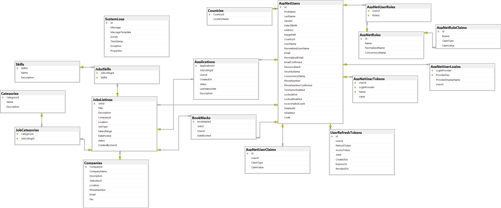

# Job Portal API
Welcome to **Job Portal API** Designed to connect job seekers with employers. It provides a simple and efficient way for individuals to search for jobs, and for companies or recruiters to post new job listings.



## Technologies : 
- **.NET 8** 
- **Entity Framework Core 8** ORM for seamless database access.
- **SQL Server** Database Provider
- **ASP.NET Core Identity** for Authentication and user managements
- **JWT + Refresh Tokens** Secure, stateless authentication.
- **AutoMapper** Efficient mapping between domain models and DTOs.
- **FluentValidation** defining validation logic cleanly.
- **MediatR + CQRS Pattern** Separation of concerns for commands and queries.
- **Generic Repository Pattern** for data access layer.
- **Clean Code & Clean Architecture** for testability and maintainability.
- **MailKit** and **SMTP** for sending registration or any email notifications.


## ✨ Features :

- ### User Management
   Secure authentication and authorization system using ASP.NET Identity for managing users, roles (job seekers, employers, admins)and password hashing.

- ### Comprehensive Job Listings
   Employers can create, update, and manage job postings with detailed informations.

- ### Advanced Job Search and Categorization
   Jobs are categorized by industry (categories) and associated with required skills.

- ### User Applications Tracking
   Job seekers can apply to job listings, with applications tracked through multiple statuses (Submitted, InReview, Accepted, Rejected) along with timestamps for progress monitoring.

- ### Bookmarking System
   Users can bookmark jobs they are interested in, making it easy to save and revisit listings for future consideration.

- ### Company Profiles
   Companies can maintain detailed profiles including contact information, descriptions, and location, providing credibility and context to job listings.

- ### Exception Handling Middleware
   Centralized middleware captures and handles exceptions globally.
  
- ### Validation Pipeline
   Built-in validation pipeline ensures all incoming data is validated before processing.
- ### Authorization
   Role-based, Policy-based, and Resource-based authorization to control access to API endpoints based on user roles, custom rules, and resource ownership.
  
## 📝 Installation
1. Clone this repository to your local machine.
   ```bash
   git clone https://github.com/SaidarMo-Dev/Job_Board_API.git
   cd job-portal
   ```
2. Configure the connection string in `appsettings.json`.

3. Run the following commands to apply migrations and seed data:
  ```bash
   dotnet ef database update  
  ```
4. Start the API:
 ```bash
   dotnet run   
 ```

 ## 🔗 API Documentation
You can explore the API using Swagger UI:

http://jobportalapi.runasp.net/swagger

## 📫 Contact
If you have any questions or want to collaborate, feel free to reach out to me at:  
[saidarmohammedeco@gmail.com](mailto:saidarmohammedeco@gmail.com)

## 📝 License
This project is licensed under the MIT License. See [LICENSE](LICENSE.txt) for Details.


Don't forget to support us by 🌟 the project!!
